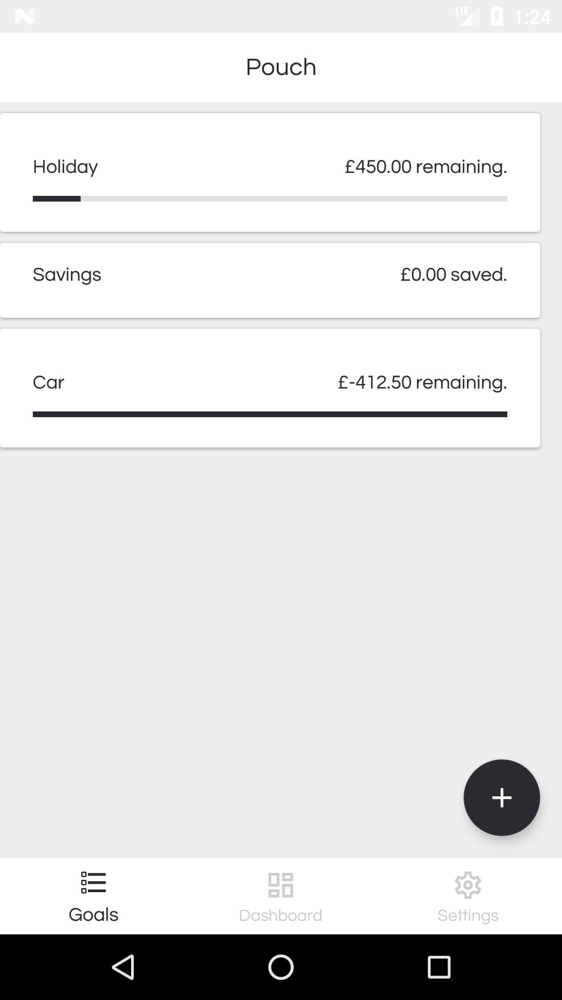
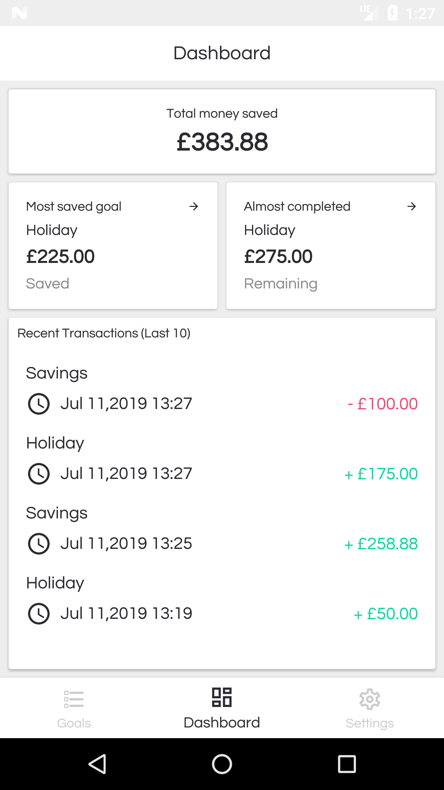
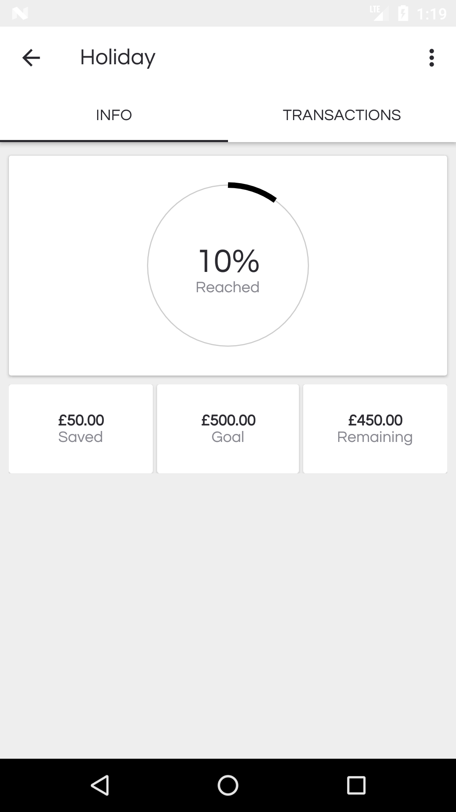
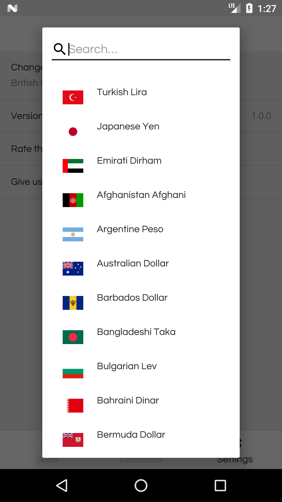

# Pouch - Money saving goal app

Inspired by the bucket app on Google PLay store (100,000+ installs)

#### Create goals

Allows you to create goals with goals with or without goal amounts.

#### Dashboard

 

You can see an overview of all your goals with the progress and amount saved; as well as seeing how much you have saved
in total, list of all recent transactions etc. 

#### Track Progress

You can check the progress of your goals and see how much money you have to save to reach the goal.

#### Change currency

Also you are able to change currencies to match the country you live in
